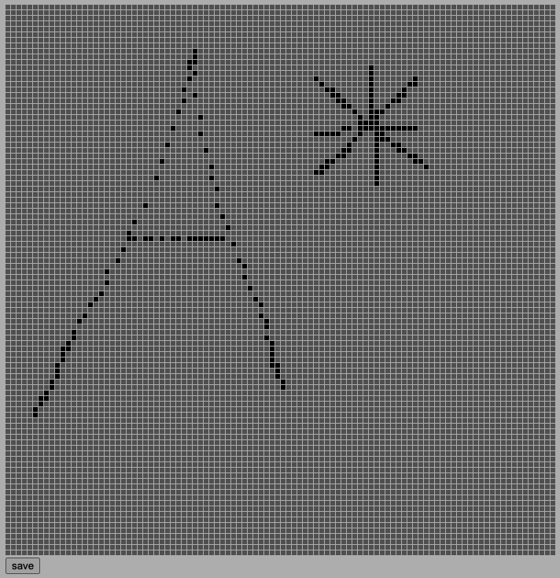

# 学习笔记
> 第二周 ： 3月1日 - 3月7日

## Map Editor 地图编辑器
  
第一个小目标是制作一个地图编辑器，大小为100x100单位。地图将被绘制在一个`div#container`之中，搭配一个按钮用于保存。  
### 保存地图
```html
<button onclick="localStorage['map'] = JSON.stringify(map)">save</button>
```
通过`localStorage`来保存当前地图对象`map`。
### 变量
`mousedown`  
布尔变量，用于监听鼠标是否被按下。  

`clear`  
布尔变量，用于监听是否为鼠标右键被按下，以清除地图中的点。

`map`  
数组，用来保存地图数据，初始值为带有10000个0的数组。

`container`  
HTML元素，通过`document.getElementById`获取

### 绘制方式
* 通过嵌套迭代，画出其x与y轴上各点。
* 地图对象中0为灰色，1为黑色以区分。
* 为每一个点添加鼠标落下事件监听。
  * 鼠标任意键落下，`mousedown`状态为`true`
  * 鼠标右键落下，`clear`状态为`true`
  * 鼠标收起，`mousedown`状态为`false`
* 屏蔽鼠标右键弹出菜单
```javascript
for (let y = 0; y < 100; y++) {
    for (let x = 0; x < 100; x++) {
        let cell = document.createElement('div');
        cell.classList.add('cell');

        if (map[100 * y + x] === 1) {
            cell.style.backgroundColor = 'black';
        }

        cell.addEventListener("mousemove", () => {
            if (mousedown) {
                if (clear) {
                    cell.style.backgroundColor = "";
                    map[100 * y + x] = 0;
                } else {
                    cell.style.backgroundColor = "black";
                    map[100 * y + x] = 1;
                }
            }
        });
        container.appendChild(cell);
    }
}

document.addEventListener("mousedown", e => {
    mousedown = true;
    clear = (e.button === 2); //.which is non-standard, so use .button
});
document.addEventListener("mouseup", () => mousedown = false);
document.addEventListener("contextmenu", e => e.preventDefault());
```
### 风格样式
因为地图中每个小点都是一个简单的`div`，所以添加风格样式以能更好的可视化。
```css
.cell {
    display: inline-block; /* 因为需要将多个div横排显示 */
    width: 6px;
    height: 6px;
    background-color: gray;
    border-bottom: solid 1px white;
    border-right: solid 1px white;
    vertical-align: top;
}

#container {
    width: 700px; /* min: (6+1)*100 = 700px ~ max: 700+6=706 */
    line-height: 1px; /* 设置行高使得每个div左右上下间距一致 */
}
```

## Path find 寻路
### 寻路方式
规则
* 在当前某一起点，可以向上、下、左、右、左上、右上、左下、右下，八个方向移动。
* 每次仅能移动一个单位长度。
* 不能跨越障碍物。  

方式：从起点开始，以某种方式移动，并记录已访问的位置，判断该位置是否为终点。  

#### 通用方法  
`insert(x, y)`  
向可访问点中添加当前访问的点，可视化时标记颜色。
* 边界判断  
  * x/y位置是否小于0或大于等于边界长度
  * 判断当前位置是否为障碍物/已访问点
* 可视化时标记颜色
* 向地图中标记该访问点  
* 向可访问点数据结构中添加该访问点

`findPath(map, start, end)`
寻路方法，`map`为当前地图，记录可访问点与障碍。`start`和`end`分别记录寻路起始位置以及终结位置。
* 向可访问点数据结构中标记起点`start`
* 循环，但凡可访问点中存在访问点
  * 验证该点是否是终点
    * 如果是，则完成寻路
  * 如果不是，将该点的八个方向插入可访问点。

### 深度优先 DFS (Depth First Search)
深度优先与广度优先的区别主要在于数据结构。  
深度优先选择`stack`栈作为存储数据结构，故先进后出。   
JavaScript中通过简单数组表示栈时，
* 入栈 `push()`
* 出栈 `pop()`

### 广度优先 BFS (Breath First Search)
广度优先选择`queue`队列作为存储数据结构，故先进先出。  
JavaScript中通过简单数组表示队列时，
* 入列 `push()`
* 出列 `shift()`

### 启发式搜索 (Heuristic Search) - A*
A*搜索通过当前可访问点到终点的距离长短来抉择先访问某个点。  
两点距离公式: `(x1-x2)^2 - (y1-y2)^2`  
所以，我们需通过一个`Sorted`的数据结构，保证：
* 插入数据时可直接方便快捷地插入
* 取出数据时需取出当前数据中的最小值
