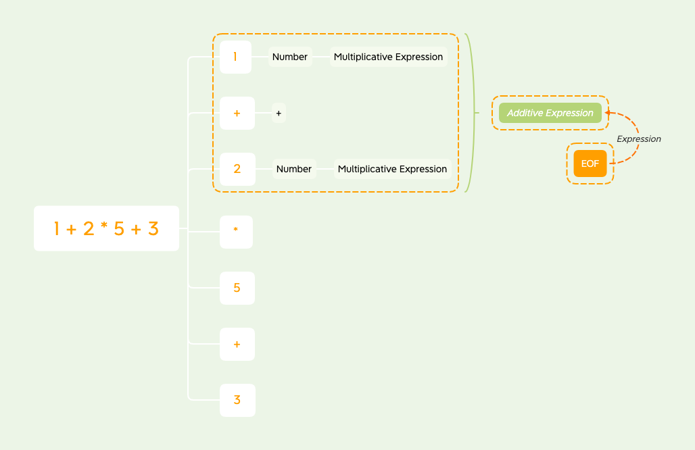

# 学习笔记
> 第三周 ： 3月8日 - 3月14日

## LL算法
Left-Left算法
* 从左到右扫描
* 从左到右规约

### 四则运算分析
#### 词法定义
* TokenNumber (Number):
  * `1` `2` `3` `4` `5` `6` `7` `8` `9` `0` 数字的组合
    
* Operator：
  * `+` `-` `*` `/` 运算符的组合
    
#### 语法定义
```text
<Expression> ::= <AdditiveExpression><EOF>

<AdditiveExpression> ::=
    <MultiplicationExpression>
    |<AdditiveExpression><+><MultiplicativeExpression>
    |<AdditiveExpression><-><MultiplicativeExpression>
    
<MultiplicativeExpression> ::=
    <Number>
    |<MultiplicativeExpression><*><Number>
    |<MultiplicativeExpression></><Number>
```
* 终结符 (直接通过词法扫描得来) Terminal Symbol：
  * `<EOF>` End of File
  * `<Number>`
  *  `<*>` `</>` `<+>` `<->`
    
* 非终结符 Non-terminal Symbol： 通过终结符的组合而来

#### 代码示例
`source`数组中不存在`Whitespace`和`LineTerminator`，因为我们早已把他们剥离出来了。
```javascript
for (let token of tokenize("1 + 2 * 5 + 3")) {
    if (token.type !== "Whitespace" && token.type !== "LineTerminator") {
        source.push(token);
    }
}
```

`tokenize(source)`  
这是一个生成器，通过正则表达式不断扫描`source`中的内容，以生成token。  
```javascript
var regexp = /([0-9\.]+)|([ \t]+)|([\r\n]+)|(\*)|(\/)|(\+)|(\-)/g;
var dictionary = ["Number", "Whitespace", "LineTerminator", "*", "/", "+", "-"];

function* tokenize(source) {
    var result = null;
    var lastIdx = 0;
    while (true) {
        lastIdx = regexp.lastIndex;
        result = regexp.exec(source);

        if (!result) break;
        if (regexp.lastIndex - lastIdx > result[0].length) break;

        let token = {
            type: null,
            value: null
        }

        for (var i = 1; i <= dictionary.length; i++) {
            if (result[i]) {
                token.type = dictionary[i - 1];
            }
        }
        token.value = result[0];
        yield token; // When return a serializable object, use yield
    }
    yield {
        type: 'EOF'
    }
}
```

* 正则表达式
  * `//g`全局匹配
  * 每个括号表示一个可选匹配
  * 每位匹配的内容与`dictionary`数组中的内容一一对应
  * `regexp.exec(str)`来匹配字符
    * 如果匹配成功，返回一个带有`index`, `input`,`lastIndex`等数据的数组
    * 如果匹配失败，返回`null`，并且`lastIndex`设置为0
  
* 如果没有匹配或超界，则断开`while`循环
* 如果存在匹配，便生成对应的token
* 完成正则匹配的最后生成`EOF`token

`MultiplicativeExpression(token)`  
该方法通过token来生成`MultiplicativeExpression`
```javascript
function MultiplicativeExpression(source) {
    if (source[0].type === ExpressionLabel.Number) {
        let node = {
            type: ExpressionLabel.MultiplicativeExpression,
            children: [source[0]]
        }
        source[0] = node;
        return MultiplicativeExpression(source);
    }
    if (source[0].type === ExpressionLabel.MultiplicativeExpression
        && source[1] && source[1].type === "*") {
        let node = {
            type: ExpressionLabel.MultiplicativeExpression,
            operator: "*",
            children: []
        }
        node.children.push(source.shift());
        node.children.push(source.shift());
        node.children.push(source.shift());
        source.unshift(node);
        return MultiplicativeExpression(source);
    }
    if (source[0].type === ExpressionLabel.MultiplicativeExpression
        && source[1] && source[1].type === "/") {
        let node = {
            type: ExpressionLabel.MultiplicativeExpression,
            operator: "/",
            children: []
        }
        node.children.push(source.shift());
        node.children.push(source.shift());
        node.children.push(source.shift());
        source.unshift(node);
        return MultiplicativeExpression(source);
    }
    if (source[0].type === ExpressionLabel.MultiplicativeExpression) {
        return source[0];
    }

    return MultiplicativeExpression(source);
}
```
* 根据优先级，先判断第一个token类型是否为`Number`
  * 如果是，那么包装节点为`MultiplicativeExpression`，放到`source`数组头部后回调。
  
* 如果不是，判断第一个token类型是否为`MultiplicativeExpression`，并依次判断其下一个token是否为 `*`或`/`
  * 如果是，那包装前三个token为`MultiplicativeExpression`节点，放到`source`数组头部后回调。

* 如果依然不是，简单判断token类型是否为`MultiplicativeExpression`然后返回。这时意味着这个函数的使命完成了。

`AdditiveExpression(token)`
与`MultiplicativeExpression(token)`类似，通过token来生成`AdditiveExpression`
```javascript
function AdditiveExpression(source) {
    if (source[0].type === ExpressionLabel.MultiplicativeExpression) {
        let node = {
            type: ExpressionLabel.AdditiveExpression,
            children: [source[0]]
        }
        source[0] = node;
        return AdditiveExpression(source);
    }
    if (source[0].type === ExpressionLabel.AdditiveExpression
        && source[1] && source[1].type === "+") {
        let node = {
            type: ExpressionLabel.AdditiveExpression,
            operator: "+",
            children: []
        }
        node.children.push(source.shift());
        node.children.push(source.shift());
        MultiplicativeExpression(source);
        node.children.push(source.shift());
        source.unshift(node);
        return AdditiveExpression(source);
    }
    if (source[0].type === ExpressionLabel.AdditiveExpression
        && source[1] && source[1].type === "-") {
        let node = {
            type: ExpressionLabel.AdditiveExpression,
            operator: "-",
            children: []
        }
        node.children.push(source.shift());
        node.children.push(source.shift());
        MultiplicativeExpression(source);
        node.children.push(source.shift());
        source.unshift(node);
        return AdditiveExpression(source);
    }
    if (source[0].type === ExpressionLabel.AdditiveExpression) {
        return source[0];
    }
    MultiplicativeExpression(source);
    return AdditiveExpression(source);
}
```
* 代码结构与`MultiplicativeExpression(source)`非常相似
  * 区别在于处理`source`数组中第三个token时、
  * 或判断第一个和第二个token均失败时，
    * 需要额外执行一步`MultiplicativeExpression(source)`，这样做的目的在于使其满足语法定义。
    ```text
    <AdditiveExpression> ::=
        <MultiplicationExpression>
        |<AdditiveExpression><+><MultiplicativeExpression>
        |<AdditiveExpression><-><MultiplicativeExpression>
    ```

`Expression(token)`  
该方法是将token生成为最终的`Expression`，包含处理`EOF`字符。
```javascript
function Expression(tokens) {
    if (source[0].type === ExpressionLabel.AdditiveExpression
        && source[1] && source[1].type === "EOF") {
        let node = {
            type: ExpressionLabel.Expression,
            children: [source.shift(), source.shift()]
        }
        source.unshift(node);
        return node;
    }
    AdditiveExpression(source);
    return Expression(source);
}
```
* 代码逻辑也是按照语法定义而来

